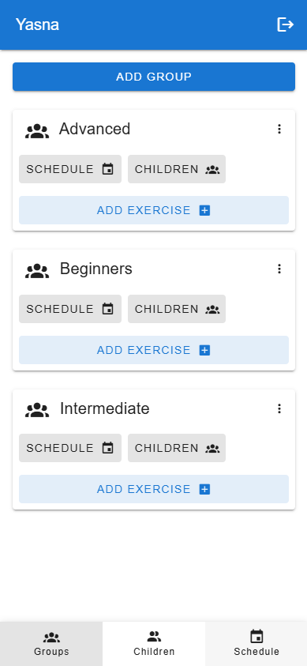
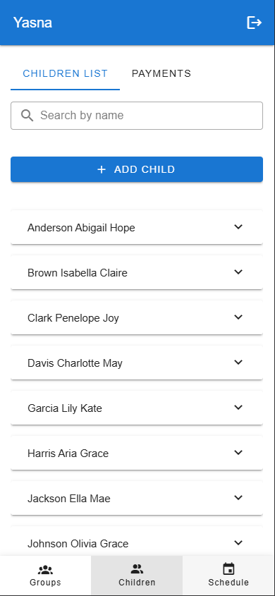
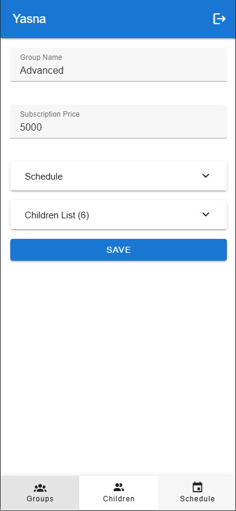
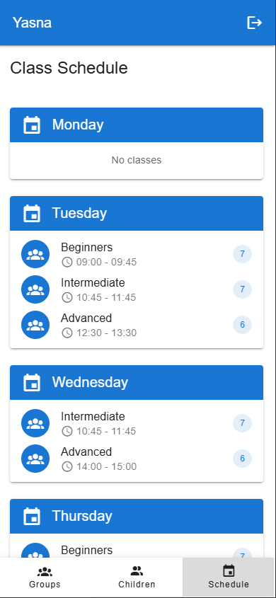
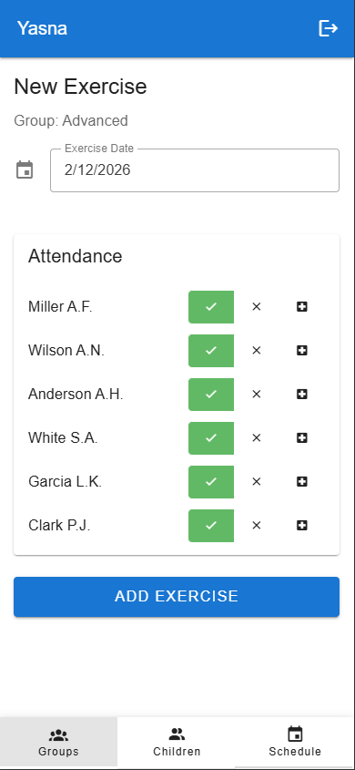

# Yasna — Rhythmic Gymnastics Club Management

A mobile-first, full-stack web application for managing a rhythmic gymnastics club: children, groups, class schedules, and attendance tracking. Designed primarily for use on smartphones and tablets.

> **Note:** This is a portfolio project. The primary focus is on the **frontend** implementation — mobile-first UI, component architecture, state management, TypeScript usage, and UX.

### [Live Demo](https://gymnastic-club-manager-client.vercel.app/)

Demo credentials: `admin` / `admin` (full access) or `test` / `test` (read-only)



## Key Features

- **Authentication** — JWT-based login with role support (admin / user)
- **Children Management** — full CRUD, search, health certificate tracking
- **Groups** — create groups, assign children, set subscription price
- **Schedule** — weekly schedule view with time slots per group
- **Attendance** — per-session attendance tracking (present / absent / sick)

| Children List | Group View | Schedule | Attendance |
|:---:|:---:|:---:|:---:|
|  |  |  |  |

## Tech Stack

### Frontend (the focus of this project)

| Technology | Purpose |
|---|---|
| **Nuxt 3** (SPA mode) | Framework |
| **Vue 3** + **TypeScript** | UI + type safety |
| **Vuetify 3** | Component library |
| **Pinia** | State management |
| **SCSS** | Styling |

### Backend

| Technology | Purpose |
|---|---|
| **Node.js** + **Express** | REST API |
| **TypeScript** | Type safety |
| **MongoDB** + **Mongoose** | Database |
| **JWT** | Authentication |

## Project Structure

```
├── client/                  # Frontend (Nuxt 3)
│   ├── api/                 # API layer (typed HTTP calls)
│   ├── components/          # Reusable Vue components
│   ├── layouts/             # App layouts (default, auth)
│   ├── pages/               # File-based routing
│   ├── stores/              # Pinia stores (auth, children, group, exercise)
│   ├── types/               # Shared TypeScript interfaces
│   └── utils/               # Helper functions
│
├── server/                  # Backend (Express)
│   └── src/
│       ├── middleware/       # JWT auth middleware
│       ├── models/          # Mongoose schemas
│       ├── routes/          # REST endpoints
│       └── seed.ts          # DB seeder with demo data
│
└── package.json             # Root (npm workspaces)
```

## Getting Started

### Prerequisites

- **Node.js** 18+
- **MongoDB** (local instance or [MongoDB Atlas](https://www.mongodb.com/atlas))

### Installation

```bash
# Clone the repo
git clone https://github.com/davidblane667/gymnastic-club-manager.git
cd gymnastic-club-manager

# Install dependencies (uses npm workspaces)
npm install
```

### Environment Variables

Create `.env` files from the provided examples:

```bash
# Server
cp server/.env.example server/.env

# Client
cp client/.env.example client/.env
```

### Run

```bash
# Start the client (localhost:3000)
npm run dev --prefix client

# Start the server (localhost:3001)
npm run dev --prefix server

# Seed the database with demo data
npm run seed --prefix server
```

### Demo Credentials

After running the seed script:

| Username | Password | Role |
|---|---|---|
| `admin` | `admin` | Admin |
| `test` | `test` | User |

## API Overview

| Method | Endpoint | Description |
|---|---|---|
| POST | `/api/auth/login` | Login |
| GET | `/api/children` | List children |
| POST | `/api/children` | Create child |
| GET | `/api/groups` | List groups |
| POST | `/api/groups` | Create group |
| GET | `/api/groups/:id` | Group with children |
| GET | `/api/exercises` | List exercises |
| POST | `/api/exercises` | Create exercise |
| GET | `/api/health` | Health check |

All endpoints except `/api/auth` and `/api/health` require a JWT token.

## License

[MIT](./LICENSE)
